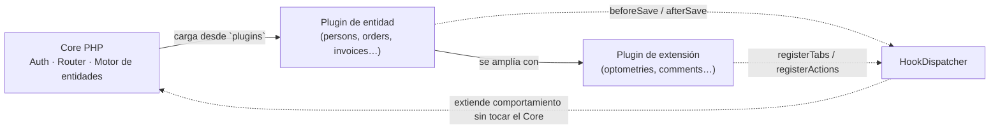

# Xestify

Xestify es una plataforma web local-first para pequeños negocios, pensada
para ejecutarse en una Raspberry Pi 5 dentro de cada empresa. Combina
soberanía de datos y seguridad local con flexibilidad funcional mediante un
sistema de plugins.

---

## 📑 Índice

- [Visión del producto](#-visión-del-producto)
- [¿Cómo funciona?](#-cómo-funciona)
- [Arquitectura técnica](#️-arquitectura-técnica-resumen)
- [Modelo de datos](#️-modelo-de-datos)
- [Sistema de plugins](#-sistema-de-plugins)
- [Sistema de hooks](#-sistema-de-hooks)
- [Actualizaciones y mantenimiento](#-actualizaciones-y-mantenimiento)
- [Seguridad](#-seguridad)
- [Casos de uso objetivo](#-casos-de-uso-objetivo)
- [Runtime web y desarrollo local](#️-runtime-web-y-desarrollo-local)
- [Operaciones de instalación](#️-operaciones-de-instalación)
- [Estado actual del proyecto (MVP)](#-estado-actual-del-proyecto-mvp)
- [Futuro](#️-futuro)
- [Documentación del proyecto](#-documentación-del-proyecto)
- [Licencia y Términos de Uso](#-licencia-y-términos-de-uso)

---

## 🧭 Visión del producto

En lugar de desarrollar una aplicación distinta para cada rubro, Xestify
ofrece un Core estable y agnóstico del negocio que se adapta por
configuración y extensiones. Esto permite que una joyería, una óptica, un
taller o una ferretería usen la misma base de producto, pero con entidades,
formularios y flujos propios.

Xestify busca resolver un problema frecuente en pequeños negocios: necesitan
software personalizable, pero no quieren complejidad operativa ni depender
por completo de la nube.

La propuesta de valor se apoya en cuatro pilares:

- **Local-first real:** datos y operación principal en la sede del negocio.
- **Arquitectura modular:** nuevas capacidades sin tocar el Core.
- **Evolución controlada:** actualizaciones explícitas de plugins y del sistema.
- **Reutilización transversal:** entidades base reutilizables entre verticales de negocio.

## ⚙️ ¿Cómo funciona?

El sistema se divide en dos capas funcionales:

1. **Core** — gestiona autenticación, autorización, API, motor de entidades
   dinámicas, plugins y hooks.
2. **Plugins**:
   - *Plugins de entidad*: definen entidades base (por ejemplo, `persons`).
   - *Plugins de extensión*: se acoplan a una entidad base para ampliar su
     comportamiento (por ejemplo, `optometries` sobre `persons`).

Con este enfoque, una misma entidad base puede usarse en varios sectores con
distintos campos y extensiones, sin duplicar código estructural.

## 🏗️ Arquitectura técnica (resumen)

- **Backend:** PHP nativo orientado a API REST, sin Composer ni frameworks ([docs/01-architecture/overview.md](docs/01-architecture/overview.md))
- **Frontend:** JavaScript vanilla con renderizado dinámico por metadata, sin build step ([docs/05-frontend/README.md](docs/05-frontend/README.md))
- **Estilos UI:** Tailwind CSS generado localmente (`frontend/tailwind.config.cjs`, `frontend/src/css/tailwind.src.css`), sin CDN en runtime
- **Persistencia:** PostgreSQL con modelo híbrido relacional + JSONB ([docs/02-entities/README.md](docs/02-entities/README.md))
- **Extensión:** sistema de plugins y hooks por eventos ([docs/04-plugins/README.md](docs/04-plugins/README.md))
- **Operación:** Apache + PHP como runtime canónico, instalador CLI idempotente y despliegue local en Raspberry Pi 5 ([docs/08-operations/README.md](docs/08-operations/README.md))

## 🗄️ Modelo de datos

Cada empresa opera con su propia base de datos. El modelo combina:

- **Tablas Core** para control estructural: registro de plugins (catálogo de
  entidades y extensiones), datos de entidad, datos de extensión y usuarios.
- **JSONB** para campos variables y evolución dinámica de esquemas
  (`manifest_json`, `schema_json`, `content`).

Esto evita cambios destructivos frecuentes en tablas físicas y permite que un
plugin agregue campos o capacidades sin rediseñar toda la base.

## 🧩 Sistema de plugins

Cada plugin tiene una estructura estándar con metadatos y esquema
declarativo:

- `manifest.json` con identificación, tipo (`entity`/`extension`), versión y
  compatibilidad.
- `schema.json` con definición de campos, identidades y relaciones.
- Clase `Hooks.php` para integración con el Core.
- `plugin.js` opcional para componentes de UI específicos del plugin.

El ciclo de vida soportado incluye:

- `onInstall`
- `onActivate`
- `onDeactivate`

`onUpdate(array $context)` se soporta como convención opcional durante una
actualización explícita del plugin.

## 🪝 Sistema de hooks

Los hooks permiten extender comportamiento sin modificar el núcleo. Se
contemplan tres grupos:

- Hooks de ciclo de vida de plugin.
- Hooks de entidad (`beforeSave`/`afterSave` en validación, guardado y borrado).
- Hooks de UI (`registerTabs`, `registerActions`).

Este mecanismo habilita casos como agregar pestañas y acciones
personalizadas en la ficha de una entidad base.

## 🔄 Actualizaciones y mantenimiento

El ciclo de vida de un plugin ya instalado se gestiona en tres pasos
explícitos, sin automatismos en cada request:

1. **Sincronizar** (`POST /api/v1/plugins/sync`): registra plugins nuevos
   encontrados en disco y detecta si hay una versión más reciente disponible,
   preservando la versión y el schema en ejecución de los ya instalados.
2. **Actualizar** (`POST /api/v1/plugins/{slug}/update`): aplica la nueva
   versión con una fusión aditiva de schema, guardando primero un snapshot en
   `plugin_update_history`.
3. **Revertir** (`POST /api/v1/plugins/{slug}/rollback`): restaura versión y
   schema desde el snapshot previo cuando existe.

Todo el flujo se controla desde `PluginManager` en el frontend, con feedback
visual de versión disponible y confirmación antes de aplicar cambios.

## 🔐 Seguridad

Como plataforma local para la operación diaria de un negocio, Xestify
implementa:

- Autenticación JWT con sesión deslizante y expiración controlada.
- Autorización binaria por rol (`admin` / usuario estándar) en operaciones
  administrativas (gestión de usuarios, plugins y configuración).
- Validación server-side obligatoria contra el schema vigente de cada entidad.
- Consultas SQL parametrizadas (PDO) en toda la capa de acceso a datos.
- Usuarios seed de demostración protegidos frente a edición, borrado y
  autoservicio.
- Scripts de `tools/` exclusivamente de línea de comandos: rechazan cualquier
  otro SAPI y quedan fuera del árbol servible por web.

Detalle completo en [docs/07-security/README.md](docs/07-security/README.md).

## 🎯 Casos de uso objetivo

- Gestión de clientes, distribuidores y profesionales con campos configurables por negocio.
- Gestión de productos, pedidos y facturación con relaciones entre entidades.
- Extensiones verticales por sector (por ejemplo, fichas de optometría en una óptica).
- Evolución funcional por instalación de plugins adicionales, sin tocar el Core.

## 🖥️ Runtime web y desarrollo local

Xestify se sirve bajo un único origen con Apache + PHP:

- `/` entrega la shell frontend (`frontend/src/index.html`)
- `/css/*` y `/js/*` sirven los estáticos del frontend
- `/api/*` y `/health` entran por `backend/public/index.php`
- `/plugins/*` sirve `plugin.js` y assets de plugins

La aplicación detecta su `base path` en runtime, así que puede colgar tanto
de la raíz del host como de una subruta Apache, por ejemplo
`http://localhost/xestify/`.

En desarrollo, los tests HTML del frontend pueden exponerse bajo `/tests/*`
activando `ENABLE_TEST=1` en Apache. La configuración de referencia vive en
[docs/08-operations/apache-vhost-examples.md](docs/08-operations/apache-vhost-examples.md).

## 🛠️ Operaciones de instalación

Para la guía detallada de instalación y configuración (requisitos, scripts
de `tools/setup/`, y recomendaciones de rendimiento en local), consulta
[INSTALL.md](INSTALL.md).

## 📊 Estado actual del proyecto (MVP)

**Corte funcional:** EPIC 0 a EPIC 11 cerrados al completo — MVP finalizado.
Detalle completo en [backlog](docs/11-backlog/backlog.md) y
[roadmap](docs/11-backlog/roadmap.md).

- **EPIC 0 — Preparación técnica:** estructura del repo, contenedor DI,
  router HTTP y entorno local PHP+PostgreSQL sin frameworks.
- **EPIC 1 — Autenticación:** login JWT (HS256), middleware de autenticación
  y usuarios persistidos en base de datos.
- **EPIC 2 — Modelo de datos core:** esquema base con tablas relacionales +
  JSONB y el `GenericRepository` para CRUD genérico.
- **EPIC 3 — Motor de entidades dinámicas:** validación contra schema,
  `EntityService`, endpoints REST y los primeros componentes de frontend
  dinámico (`DynamicForm`, `DynamicTable`).
- **EPIC 4 — Plugins y hooks backend:** carga y ciclo de vida de plugins,
  `HookDispatcher` y el primer plugin de entidad real.
- **EPIC 5 — Frontend dinámico base:** login, navegación, integración E2E
  entidad-formulario y componentes reutilizables.
- **EPIC 6 — Plugins de extensión:** `plugins` pasa a ser la única fuente de
  verdad del catálogo de entidades, hooks de UI (`registerTabs`/
  `registerActions`) y el primer plugin de extensión (`comments`).
- **EPIC 7 — Actualizaciones y rollback de plugins:** detección de
  versiones, sync/update explícito con schema aditivo, snapshots y rollback,
  con su UI en `PluginManager`.
- **EPIC 8 — Gestión de usuarios:** perfil propio, administración de
  usuarios y menú de usuario en la navegación.
- **EPIC 9 — Sistema UI y arquitectura SPA:** fundamentos visuales, shell
  persistente, routing hash completo, resiliencia de UI e i18n/theming base.
- **EPIC 10 — Login, Persons y plugins de demostración:** rediseño de login,
  `clients` renombrado a `persons`, identidad de plugin desacoplada del
  slug, y plugins de demostración (`orders`, `invoices`, `optometries`,
  `contact_lenses`) con datos de ejemplo sembrados.
- **EPIC 11 — Cierre formal del MVP:** auditoría de código limpio,
  verificación funcional E2E, auditoría de coherencia de documentación y
  guion de defensa del TFM.

Detalle story a story, tests y verificación de cada cierre en
[docs/10-productivity/sesion.md](docs/10-productivity/sesion.md).

## 🗺️ Futuro

Con el MVP cerrado, el roadmap se centra en profundizar la experiencia de
usuario, la operación en producción y la extensibilidad del ecosistema de
plugins: pulir accesibilidad y rendimiento percibido del frontend, dotar al
sistema de observabilidad y hardening para despliegues reales, abrir un
marketplace de plugins publicables e instalables desde la propia UI, y
completar el modelo de relaciones y permisos para casos de uso más
avanzados.

### Adiciones post-MVP

- **EPIC A1 — Ajustes finos de UI/UX:** internacionalización real, búsqueda
  en tablas, rendimiento percibido, accesibilidad y operaciones avanzadas de
  tabla/CRUD.
- **EPIC A2 — Operación técnica y observabilidad:** health checks, backup
  automatizado y hardening básico para despliegue en Raspberry Pi 5.
- **EPIC A3 — Marketplace de plugins:** repositorio central de plugins,
  navegables e instalables desde la UI.
- **EPIC A4 — QA y calidad:** suite de tests completa, automatización CI y
  cobertura mínima establecida.
- **EPIC A5 — Auditoría funcional:** trazabilidad de acciones críticas
  sobre configuración, usuarios y plugins.
- **EPIC A6 — Matriz de permisos fina:** permisos granulares por
  recurso/acción, más allá del gate binario admin/no-admin actual.
- **EPIC A10 — Relaciones avanzadas (`has_many`/`has_one`):** completar el
  modelo de relaciones más allá de `belongs_to`.

Detalle completo en [docs/11-backlog/roadmap.md](docs/11-backlog/roadmap.md).

## 📚 Documentación del proyecto

Índice principal: [docs/README.md](docs/README.md)

| Área | Documento |
|---|---|
| Instalación | [INSTALL.md](INSTALL.md) |
| Visión, convenciones y glosario | [docs/00-meta/README.md](docs/00-meta/README.md) |
| Arquitectura y patrones | [docs/01-architecture/README.md](docs/01-architecture/README.md) |
| Modelo de datos y entidades | [docs/02-entities/README.md](docs/02-entities/README.md) |
| API REST | [docs/03-api/README.md](docs/03-api/README.md) |
| Plugins y extensiones | [docs/04-plugins/README.md](docs/04-plugins/README.md) |
| Frontend y UI dinámica | [docs/05-frontend/README.md](docs/05-frontend/README.md) |
| Seguridad | [docs/07-security/README.md](docs/07-security/README.md) |
| Operaciones y despliegue | [docs/08-operations/README.md](docs/08-operations/README.md) |
| Historial de decisiones | [docs/09-history/README.md](docs/09-history/README.md) |
| Productividad y flujo IA | [docs/10-productivity/README.md](docs/10-productivity/README.md) |
| Backlog y roadmap | [docs/11-backlog/README.md](docs/11-backlog/README.md) |

## 🔒 Licencia y Términos de Uso

Este proyecto es el resultado de un Trabajo de Fin de Máster (TFM) y se
publica bajo una **Licencia Propietaria de Fuente Disponible (Source-Available
/ Read-Only)**.

- **Permitido:** consulta visual, lectura y auditoría del código fuente con
  fines académicos o de evaluación.
- **Estrictamente prohibido:** la ejecución, compilación, despliegue,
  modificación, redistribución o uso del software, ya sea con fines
  comerciales o personales, sin la autorización previa y por escrito del
  autor.

Para más detalles, consulta el archivo completo [`LICENSE.md`](LICENSE.md).

---

*Si deseas obtener una licencia de uso comercial o evaluación extendida,
ponte en contacto en: brass4study@gmail.com*
